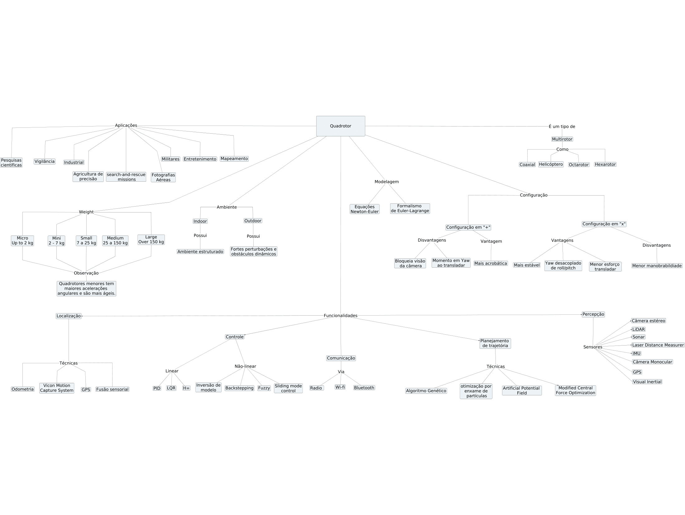

Quadrotores são veículos aéreos não tripulados (VANTs) que são comumentes chamados de <strong>drones</strong>, que em inglês significa zangão ou zumbido, pelo barulho gerado pelos rotores em sua operação. Seu uso tem se popularizado tanto em aplicações civis como em aplicações militares, por serem muito ágeis, com grande manobrabilidade e payload, além de possuírem a habilidade de realizar vôos estacionários ou quase estacionários e também pouso e decolagem vertical.

Quadrotores são aeronaves de asas rotativas, ou seja, são sustentadas e movimentadas por rotores. Diferente das aeronaves de asas fixas, como aviões, as aeronaves de asas rotativas não utilizam seu movimento horizontal para sustentar seu vôo, fazendo com que esse tipo de veículo apresente um consumo energético muito alto . 

<!-- Esses veículos são comumentes chamados de drones, que em inglês significa zangão ou zumbido, pelo barulho gerado pelos seus rotores em sua operação. Os movimentos do quadrotor são obtidos através da combinação das velocidades angulares desses rotores. Para balancear o contra-torque gerado por seus propulsores, é necessário que um par de rotores que estão em uma mesma haste esteja girando no sentido horário, enquanto o outro par de rotores esteja girando no sentido anti-horário. -->

  

 

## Estudo do Estado da Arte

O estudo do estado da arte (SOTA, do inglês) permite fazer o levantamento das principais tecnologias que estão sendo desenvolvidas em um determinado assunto, assim como as principais investigações e estudos que foram feitos nos últimos anos. 

Para dar suporte no desenvolvimento de um quadrotor autônomo com capacidade de realizar pouso em uma plataforma móvel, foi realizado um SOTA sobre esse tipo de veículo, fazendo o estudo das suas aplicações, suas principais funcionalidades (controle, localização e planejamento de trajetória) e também dos seus principais componentes. A metologia utilizada para o desenvolvimento desse estudo foi o método BILI.

<!-- Foi realizado um documento de estudo do estado da arte para dar suporte no desenvolvimento de um quadrotor autônomo com capacidade de realizar pouso em uma plataforma móvel. Trazendo conhecimento das melhores técnicas que vem sendo utilizadas em áreas como navegação, controle e localização e mapeamento simultâneos (SLAM), assim como os melhores modelos, arquiteturas para conceber um veículo eficiente e principais componentes. A metologia utilizada para o desenvolvimento desse estudo foi o método BILI. -->

## Método BILI

A pesquisa do estudo do estado da arte desenvolvida neste documento foi elaborada principalmente a partir do método BILI, que permite realizar uma pesquisa bibliográfica em um banco de dados de artigos científicos, publicações em periódicos, livros e outras fontes de conhecimento científicos, fazendo o levantamento das publicações e dos autores mais impactantes na área pesquisada. Também foram realizadas pesquisas para avaliar as soluções já encontradas no mercado. O método BILI é dividido em quatro ciclos que acontecem em sequência, como mostrado na figura a seguir. Eles são chamados de ciclo ingênuo, ciclo otimizada, ciclo de impacto e ciclo de produção, são mais detalhados no documento.

{:.center}
 

 

## Classificações

Os quadrotores são classificados em categorias, possuindo cada uma delas características específicas, que podem ajudar no design do projeto e também na escolha de componentes que vão ajudar na operação da aeronave. 

### Classificação Quanto ao Peso

<!-- A classificação quanto ao peso de um quadrotor depende do autor. Em  os quadrotores são classificados como nano drones, micro drones, mini drones, small drones, tactical drones ou como MALE, HALE ou Strike drones. Segundo a Agência Nacional de Aviação Civil , os drones são classificados como Classe 1, Classe 2 ou Classe 3, de acordo com seu peso, e cada classificação dessa possui regulamentação específica. -->

Segundo a Agência Nacional de Aviação Civil , os drones são classificados como Classe 1, Classe 2 ou Classe 3, de acordo com seu peso:

* Classe 1 - Peso acima de 150 kg;
* Classe 2 - Peso de 25 kg até 150 kg;
* Classe 3 - Peso até 25 kg.

Drones de até 250 gramas não precisam ser cadastrados junto à ANAC. Cada classe dessa possui regulamentação específica. É possível acessar o regulamento no [link](https://www.anac.gov.br/assuntos/legislacao/legislacao-1/rbha-e-rbac/rbac).

### Classificação Quanto a Configuração

Os quadrotores também são classificados quanto ao seu formato. Eles podem ter a configuração em forma de "+", em que a frente da aeronave fica alinhada com uma das hastes que suporta um par de rotores, ou a configuração em "x", em que a frente da aeronave fica a 45◦ do eixo que contém a haste da aeronave, ficando assim a frente da aeronave no meio de duas hastes, como mostrado na figura.

  

A configuração em "+" é mais acrobática, entretanto, como desvantagens, a haste dos rotores bloqueia o campo de visão da câmera e também apresenta um momento de guinada ao transladar, necessitando de um maior gasto energético para estabilizar a aeronave. A configuração em "x" não apresenta esse efeito, apresentando menor esforço para transladar, menor manobrabilidade e sendo mais estável. 

## Aplicações

Os quadrotores são amplamente utilizados em aplicações civis, militares e acadêmicas nos dias atuais. Em aplicações militares, pelo fato desse tipo de aeronave possuir alta manobrabilidade e possibilidade de realizar vôos estacionários ou quase estacionários, eles podem ser utilizados em missões de espionagem, monitoramento, reconhecimento e vigilância. Como elas não necessitam de um piloto embarcado, não colocando em risco o operador, e também por poderem ser muito pequenas, podem ser utilizadas em missão de busca e regaste em ambientes hostis, como em situações de desmoronamento. 

Na área civil, seu uso tem se popularizado muito para entretenimento, diversos modelos são comercializados com finalidade exclusivamente lúdica, muitas vezes equipados com câmeras para capturar fotografias. Na área cinematográfica, tem sido utilizados para a realização de vídeos e fotografias aéreas, substituindo os helicópteros, que tinham custos associados maiores para realizar esse tipo de operação. Seu uso tem se popularizado também na agricultura de precisão , como mostrado na figura a seguir, para realização de monitoramento das plantações, irrigação agrícola, semeadura e distribuição de defensivos. Tem sido utilizados também para a realização de entregas do tipo delivery, como mostrado na figura.

No ambiente acadêmico, os quadrotores são utilizados como plataforma para teste de estratégias de controle, dada a dificuldade de se estabilizar e de controlar esse tipo de veículo, e também para teste de técnicas de planejamento de trajetória, pelo seu espaço de atuação ser tridimensional, o que torna as soluções mais complexas e com maior custo computacional.

  

 

  

 

## Principais Componentes

Os principais componentes envolvidos no desenvolvimento de um quadrotor são os <strong>rotores</strong> que serão responsáveis por toda movimentação do veículo, <strong>baterias</strong> que irão garantir a energia necessária para os rotores, <strong>sensores inerciais</strong> que irão ser responsáveis pela localização e <strong>microcontroladores</strong>, responsáveis pelo cálculo das ações de controle e a integração de hardware e software.

Os quadrotores são geralmente equipados com uma IMU (Inertial Measurement Unit), que são dispositivos compostos por giroscópios, acelerômetros e magnetômetros. Através da fusão sensorial é possível obter a atitude do robô e realizar odometria. Muita vezes também são utilizados sensores do tipo barômetro, que são sensores capazes de medir a pressão atmosférica. Como a pressão atmosférica varia com a altitude, é possível mensurar
a altura da aeronave em relação ao nível do mar com a utilização desse sensor. 

Como a alimentação do quadrotor é a base de baterias de corrente contínua é adequado que sejam utilizados motores que utilizem esse tipo de alimentação. Uma boa alternativa de escolha para esse tipo de veículo é o motor brushless DC (BLDC), que é um motor de corrente contínua síncrono alimentado por corrente contínua (CC) e não possui escovas de contato elétrico. A vantagem desse tipo de motor é que
eles são altamente eficientes, pois possuem menos perdas por atrito, resultando em torques maiores. Essa eficiência é de grande valia para os quadrotores, pois um grande desafio associado a operação com esse tipo de veículo é a autonomia. A redução do atrito também faz com que a vida útil desse tipo de motor seja maior e que seja necessário ter menos manutenções, por não necessitar trocar as escovas.

As baterias mais amplamente utilizadas para UAVs são baterias polímero de lítio (LiPo). Esse tipo de bateria tem uma das melhores relações entre capacidade e peso, o que é de vital importância para esse tipo de veículo, já que o peso das baterias pode representar até 50% do peso da aeronave, como mostrado em . As baterias LiPo possuem uma capacidade regular e um bom ciclo de vida. Em , é feito um estudo do consumo de energia de multirrotores e uma modelagem para estimação da autonomia do veículo operando com baterias LiPo. Diversas pesquisas tem surgido também sobre estações de carregamento wireless de quadrotores, como mostrado em  e em .

Existem diversos modelos de microcontroladores no mercado, com diferentes frequências de operação ou clock,memória flash, RAM, EEPROM e tensão de alimentação. O clock determina quantas operações o microprocessador consegue fazer por unidade de tempo, quanto maior essa velocidade, menor é o tempo entre ações de controle, tornando o controle mais preciso. Entre as plataformas mais utilizadas estão o Arduino, a Raspberry, ARM, PIC, ESP32 e Teensy. Entre as plataformas, o Teensy se destaca, como mostrado na figura.

  

 

## Funcionalidades

As funcionalidades mais importantes e mais estudas para uma plataforma do tipo quadrotor são <strong>controle, localização e planejamento de trajetória</strong>.

<!-- <ul>
  <li><strong>Controle</strong></li>
</ul> -->

### Controle

Os quadrotores são veículos subatuados, instáveis e com comportamento dinâmico não-linear. Devido a essas características, é necessário projetar controladores bem ajustados para permitir um correto segmento de referência e rejeição de pertubação. É possível a utilização de controladores lineares, realizando a linearização do modelo dinâmico do robô para projetá-los, e também a utilização de controladores não-lineares para estabilizar e controlar a aeronave.

Os controladores que atuam no quadrotor geralmente são utilizados em cascata , de forma que existe um controle de baixo nível para garantir uma velocidade de rotação desejada nos rotores, um controlador em um nível mais alto para controlar a altitude e as velocidade angulares de rolagem, arfagem e guinada e por último um controlador no nível mais alto controlando posições lineares no espaço tridimensional , formando assim uma estrutura de controle hierárquica.

Os controlador mais comumente usado em baixo nível para controlar a velocidade de de rotação dos propulsores é o controlador Proporcional Integral Derivativo (PID) já que os rotores são sistemas SISO (single-input single-output) que podem ser representado por dinâmicas de primeira ordem.

Os controladores lineares que são mais amplamente utilizados são os controladores PID , , LQR  e H∞ . Como alguns parâmetros do quadrotor podem apresentar incertezas ou até mesmo variar durante a operação, sendo possível adicionar robustez a esses controladores, podendo ajudar também na rejeição de perturbação.

Os controladores não-lineares mais amplamente utilizados são backstepping , , o sliding mode control (SMC)  e o controlador Fuzzy , , .

Para projetar os controladores é necessário fazer uma modelagem matemática do comportamento dinâmico do veículo. Por ser uma plataforma de equilíbrio instável, se torna inviável realizar técnicas de identificação em malha aberta. Sendo assim, é necessário obter o modelo dinâmico da aeronave através de técnicas de modelagem. A modelagem da aeronave pode ser obtida através das equações de Newton-Euler ou através do formalismo de Euler-Lagrange . Através dessa modelagem é possível obter o modelo de alto nível, onde os torques e forças são entradas e as saídas são posições angulares e lineares.

### Localização

A localização do quadrotor pode ser realizada utilizando sensores embarcados no veículo ou até mesmo utilizando sensores que são externos ao mesmo. O quadrotor pode fazer uso de sensores como LiDAR, GPS, IMU, câmeras monoculares ou estéreo, sensores ultrassônicos e lasers. Em , a localização de um quadrotor é realizada utilizando a fusão sensorial de uma câmera monocular com uma IMU. Em , é feito a odometria da aeronave através da fusão sensorial feita por Filtro Estendido de Kalman de sensores laser com câmera estéreo, em aplicações de busca e resgate em ambiente urbano. É possível também obter bons resultados apenas utilizando câmeras monoculares, como mostrado em  utilizando o pacote ORB SLAM.

Para missões indoor, pode ser usado o Vicon Motion Capture System, que estima a pose do robô muito proximamente ao ground truth . Essa técnica é muito precisa e tem um tempo de amostragem rápido. O seu funcionamento é baseado no monitoramento vicon markers fixados no quadrotor através de câmeras. 

Pode-se realizar a fusão sensorial de diversos sensores para se obter uma boa estimativa da localização da aeronave. A técnica mais amplamente utilizada é a de filtragem, como a do filtro estendido de kalman (EKF), porém ela sofre com o drift, que é um deslocamento não considerado pela medição. Outra opção são frameworks de otimização não-linear, que apresentam resultados mais consistentes, porém apresentam custos computacionais superiores.

### Planejamento de Trajetória

O planejamento de trajetória é fundamental para que o quadrotor se torne uma plataforma completamente autônoma. Através dessa funcionalidade o veículo pode calcular uma rota para se deslocar da sua posição atual até uma posição final sem a interferência humana, sendo de extrema importância para o objetivo final do projeto que é tornar o drone capaz de realizar um pouso autônomo em uma plataforma móvel.

Em , é feito o planejamento de trajetória através da técnica Artificial Potential Field (APF), que é vantajosa por ser implementada através de um algoritmo de estrutura simples, com uma descrição matemática consistente e conveniente para controle em tempo real, além de possuir uma grande portabilidade, podendo solucionar o problema de desvio de obstáculos mudando a fonte do campo potencial artificial.O APF é baseado na ideia de que o destino funciona como um campo potencial atrativo para o UAV, enquanto os obstáculos funcionam como campos potenciais repulsivos.

Em , é utilizado um algoritmo de otimização derivado do Central Force Optimization (CFO), chamado de Modified Central Force Optimization. O CFO é um algoritmo de otimização de partícula inteligente baseado na lei da gravidade, onde cada solução é uma partícula. As partículas se atraem com a força gravitacional virtual. As massas dessas partículas são dependentes da função custo de cada solução.

Em , foi feito um estudo de comparação entre o planejamento de trajetória através do algoritmo genético (GA) e da otimização por enxame de partículas (PSO) em simulação. Ambas as técnicas apresentaram boas soluções em tempos computacionais relativamente curtos . Como conclusão foi observado que com significância estatística o GA apresenta melhores trajetórias ao PSO. Para comparar os resultados foi realizar o t-teste sobre o a função custo.

Em , é apresentado um método computacionalmente eficiente que calcula trajetórias com funções de posição polinomiais três vezes diferenciáveis, considerando as restrições de velocidade e aceleração do veículo. O algoritmo foi testado com a captura de uma bola arremessada.

## Conclusão

O estudo do estado da arte desenvolvido fez a investigação das técnicas que estão sendo utilizadas nas principais funcionalidades de um VANT do tipo quadrotor, as aplicações desse tipo de veículo, seus principais componentes e sua classificações. A classificação dos quadrotores é importante pois existe uma regulamentação específica para cada tipo e também porque a escolha correta de sua forma impacta nos resultados obtidos em sua operação.

No tópico de controle, pode-se observar que é possível estabilizar o veículo com controladores lineares, porem controladores não lineares são mais adequados para lidar com as incertezas paramétricas, não linearidades e também rejeição de pertubação. No planejamento de trajetória, as técnicas mais comuns, como A* e Dijkstra, possuem custos computacionais altos, pelo fato do ambiente de atuação ser tridimensional, sendo necessário a utilização de técnicas mais otimizadas, como as apresentadas. Em relação a localização, é necessário levar em consideração o ambiente de atuação, indoor ou outdoor, para a escolha adequada da técnica utilizada. Para ambientes outdoor, muitas vezes é necessário a utilização de sensor GPS e para indoor o Vicon Motion Capture System se mostra como uma solução muito precisa e eficiente.

A escolha correta de componentes também é uma tarefa importante, pois um dos grandes desafios atuais do desenvolvimento de um quadrotor é o tempo de vôo, devido ao seu alto gasto energético. A escolha de motores e microcontroladores mais eficientes, assim como de baterias com uma boa relação entre energia disponível e massa, é importante para tentar maximizar a autonomia.

<!-- ## Documento Completo

 
<iframe src ="https://drive.google.com/file/d/1Sa2GipjVxa-oJIdlsc7JlCVI1MSaQG1q/preview" width='740' height='430' allowfullscreen mozallowfullscreen webkitallowfullscreen></iframe>
  -->

## Mapa Conceitual

O mapa conceitual é uma ferramenta que facilita a compreensão dos conceitos envolvidos no estudo desenvolvido, mostrando as conexões entre palavras-chave, permitindo uma apresentação mais visual do estudo. A seguir é apresentado o mapa conceitual desenvolvido, onde aparecem as principais aplicações, ambientes de aplicação, possíveis configurações e funcionalidades.

{:.center}
 

---------------------
 



<!-- autor -->

<h3 class="post-title">Autor</h3> 

  

    <table class="table-borderless highlight">
      <thead>
        <tr>
          <th></th>
        </tr>
      </thead>
      <tbody>
        <tr class="font-weight-bolder" style="text-align: center margin-top: 0">
          <td>Mateus Seixas</td>
        </tr>
        <tr style="text-align: center" >
          <td style="vertical-align: top"><small>Pesquisador em Robótica no Centro de Competências em Robótica e Sistemas Autônomos do Senai Cimatec. Graduado e mestrando em Engenharia Elétrica pela UFBA e amante da natureza.</small></td>
          <td></td>
        </tr>
      </tbody>
    </table>
  

 