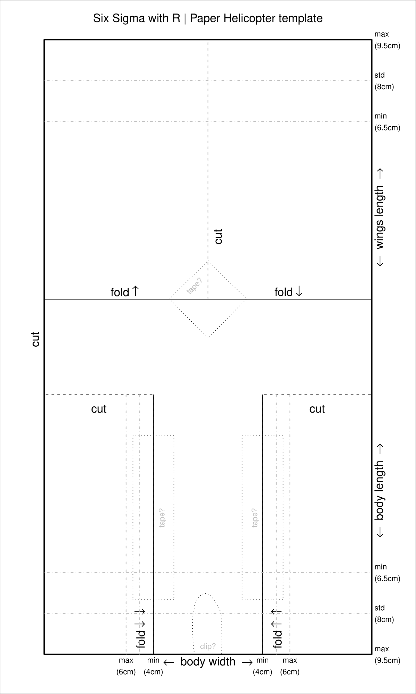

O estudo de repetibilidade e reprodutibilidade, também conhecido como estudo de R&R, é uma ferramenta estatística para fazer uma análise do sistema de medição. Todos os processos apresentam variabilidade, alguns mais outros menos. Através do estudo de R&R é possível quantificar o quão variável é um processo e o quão variável é seu sistema de medição.

A repetibilidade avalia a variabilidade nas medições feitas por um mesmo operador, sobre um único objeto, usando a mesma ferramenta. Já a reprodutibilidade avalia a variabilidade nas medições feitas por operadores diferentes, sobre um único objeto, usando a mesma ferramenta.

<!--   -->

## Experimento com Helicópteros de Papel

Em um experimento simples para aplicar o estudo de R&R, foram construídos helicópteros de papel (como mostrado na imagem) e medidos seus tempos de vôo em queda livre a uma altura fixa com auxílio de um cronômetro instalado em um celular. O experimento foi realizado por 2 operadores seguindo o mesmo método de lançamento.

  

Na primeira parte do experimento foram construídos 4 helicópteros com medidas distintas e cada operador realizou 5 execuções para cada protótipo, sendo que em cada execução foram realizados 3 lançamentos e calculado o tempo médio entre as 3, totalizando 120 lançamentos. Os lançamentos foram executados a 1,47 metros de altura, segurando o protótipo pelo clipe, como mostrado na imagem. Enquanto um operador lançava o helicóptero o outro media o tempo.

  

Na segunda parte do experimento, foram construídos 4 helicópteros com as mesmas medidas e foi realizado o mesmo número de lançamentos para cada operador. Entretanto o método de lançamento foi modificado, os protótipos passaram a ser lançados a 1,50 metros de altura, sendo segurados pelas suas hélices apoiadas em um anteparo, como mostrado no gif.

  

Para fazer o estudo de R&R do experimento, foi utilizado o pacote "SixSigma" desenvolvido para linguagem R. 
<!-- {:.center}
  -->

<!--   -->

<!--  -->
<!--   -->
 <!-- <strong>controle, localização e planejamento de trajetória</strong>. -->

<!-- ## Documento Completo

 
<iframe src ="https://drive.google.com/file/d/1Sa2GipjVxa-oJIdlsc7JlCVI1MSaQG1q/preview" width='740' height='430' allowfullscreen mozallowfullscreen webkitallowfullscreen></iframe>
  -->

<!-- ## Mapa Conceitual

O mapa conceitual é uma ferramenta que facilita a compreensão dos conceitos envolvidos no estudo desenvolvido, mostrando as conexões entre palavras-chave, permitindo uma apresentação mais visual do estudo. A seguir é apresentado o mapa conceitual desenvolvido, onde aparecem as principais aplicações, ambientes de aplicação, possíveis configurações e funcionalidades.

{:.center}
  -->

---------------------
 



<!-- autor -->

<h3 class="post-title">Autor</h3> 

  

    <table class="table-borderless highlight">
      <thead>
        <tr>
          <th></th>
        </tr>
      </thead>
      <tbody>
        <tr class="font-weight-bolder" style="text-align: center margin-top: 0">
          <td>Mateus Seixas</td>
        </tr>
        <tr style="text-align: center" >
          <td style="vertical-align: top"><small>Pesquisador em Robótica no Centro de Competências em Robótica e Sistemas Autônomos do Senai Cimatec. Graduado e mestrando em Engenharia Elétrica pela UFBA e amante da natureza.</small></td>
          <td></td>
        </tr>
      </tbody>
    </table>
  

 