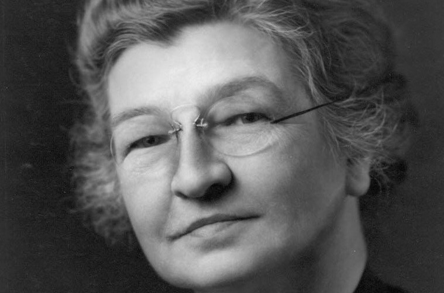
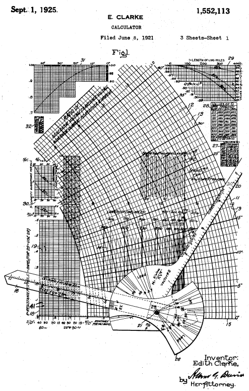

A eletricidade tem fundamental importância para a ascenção tecnológica e está presente nos ambientes mais básicos e essenciais no desenvolvimento humano, sendo algo que acompanha e que está ligada diretamente ao mundo que conhecemos hoje, dessa forma, a importância do engenheiro elétrico aponta para um longo tempo de história e de desenvolvimento...

...nesse contexto, podemos citar **Edith Clarke** como peça importante e que contribuiu ativamente com esse processo.

> "Edith Clarke foi a primeira engenheira eletricista e primeira professora de engenharia elétrica da Universidade do Texas em Austin."

{:.center bordered}

Edith Clarke nasceu no Condado de Howard no estado americano de Maryland, e, apesar de apresentar algumas dificuldades de aprendizado com a leitura e a ortografia ela demonstrou grande aptidão com a matemática e os jogos de carta. Edith foi criada por um tio por um período curto de tempo e posteriormente estudou em um internato até 1899.

Apesar do contexto do século vinte se apresentar como ***desafiador*** para as mulheres na área da engenharia, Edith escolheu dar continuidade aos estudos e utilizou a herança deixada pelos pais ao completar dezoito anos  de idade, inscrevendo-se no Vassar College em Nova York.

> Edith Clarke se forma em 1908 de forma destcável e com uma chave para a sociedade Phi Beta Kappa

**Phi Beta Kappa** é uma sociedade de honra academica dos Estados Unidos da América. 

"Tem como objetivo promover e defender a excelência nas artes liberais e ciências bem como doutrinar os alunos destas áreas que **se destacam nas faculdades e universidades norte-americanas**." A seguir uma representação do símbolo da Phi Beta Kappa:

{:.center bordered}

> Ser listada pela Beta Kappa mostra o comprometimento de Edith com seus estudos ...

Após a sua formatura, Edith ensinou matemática e física em uma escola particular em São Francisco e passou um pequeno tempo estudando engenharia civil em 1911, durante as férias do primeiro período em 1912 ela trabalhou como "Computador", era comum que ***mulheres*** com boa base de matemática trabalhassem
executando cálculos para pesquisadores ou empresas. A seguir um exemplo de funcionárias que trabalhavam como "Computadores humanos".

{:.center bordered}

{:.center}
Computer assistants

Nesse momento Edith demonstrava o seu potencial e na AT&T ficou fascinada com conceitos como circuitos elétricos e linhas de transmissão, decidindo abandonar a Engenharia Civil e seguir com **Engenharia Elétrica no MIT**, Edith se graduou em 1918 e continou o mestrado por mais um ano se tornando a **primeira mulher** a se graduar em Engenharia Elétrica na instituição.

Um dos maiores feitos realizados por Edith foi a **calculadora Clarke** em 1921. O propósito da calculadora era de facilitar
a análise de linhas de transmissão reduzindo o procedimento de cálculos em até **dez vezes**. A patente foi aprovada em Setembro de 1925.

{:.center bordered}

{:.center}
Calculadora Clarke

Edith Clark foi uma mulher de grande importância para engenharia, ela acreditava que existia demanda para bons trabalhos ...

Em 1943, foi publicado o primeiro livro, intitulado “Circuit Analysis of A-C Power Systems”. O livro foi baseado em suas notas de aula na General Electric. Edith lecionou a engenheiros da GE por muitos anos. Sua obra foi muito usada como texto-base em cursos de engenharia e como referência a engenheiros que trabalhavam com sistemas de potência. Como já faz muito tempo, você pode encontrar uma cópia gratuita do primeiro volume aqui. É como voltar no tempo!

> ”Não existe uma demanda para mulheres engenheiras, da mesma forma como não existe para médicas mulheres; mas sempre existe uma demanda para aqueles que conseguem fazer um bom trabalho” - Edith Clarke

