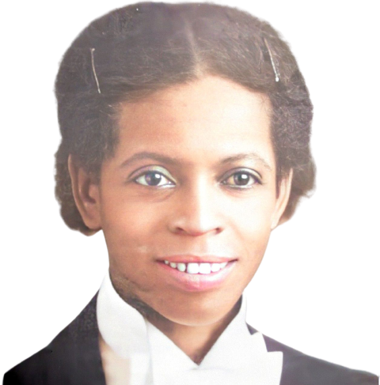

<!-- ## Introdução -->
Ana Lins dos Guimarães Peixoto (20 de agosto de 1889 - 10 de abril de 1985), eis uma representante de um verdadeiro brasileiro típico. Aquele que não se deixa desvanecer diante das adversidades da vida. Aquele que tem a esperança estampada no peito varonil. 

Ana Lins pelo pseudônimo de [Cora Coralina](https://pt.wikipedia.org/wiki/Cora_Coralina) fez brota seus poemas e contos aos 76 anos de vida, trazendo no ápice de sua sabedoria a docura em viver e em se transformar, em mudar de mente.

Para aqueles que apreciam uma boa poesia; uma poesia marcante, neste [link](https://www.culturagenial.com/cora-coralina-poemas-essenciais/) há algumas das melhores poesias de Cora Coralina e com uma boa avaliação das mesmas. Vale a pena.

Mas eu não vim aqui falar de uma grande expressão cultural. 

Geralmente quando aproximamos do marco dos dias da mulheres, somos levados a exercitar as nossas lembranças em mulheres que marcaram a história da nossa sociedade como um todo. Porém neste post, chamarei a atenção de vocês para [Enedina Alves Marques](https://pt.wikipedia.org/wiki/Enedina_Alves_Marques) (13 de janeiro de 1913 - entre 20 e 27 de agosto de 1981), a primeira engenheira do Paraná e a primeira engenheira negra do Brasil.

Enedina poderia ter buscado sua motivação na veslumbrante ascenção de Cora Coralina, porém neste período Enedina já desfrutava de sua aposentadoria, mas posso especular o quanto o filme de sua vida passou pela sua mente ao ver a ascenção, muitas vezes considerada tardia, de Cora Coralina. O quanto do reconhecimento de suas ações vanguardistas também poderíam ser consideradas?

Além de exercer a profissão de engenheira, Enedina foi professora. Em 1945 formou-se em Engenharia Civil pela UFPR, sendo a única mulher da turma; e aos 32 anos de idade deixa a sala de aula para se tornar auxiliar de engenharia da Secretaria de Estado de Viação e Obras Públicas.

Bem antes de falar de sua vida de engenheira, é bom frisar que Enedina sempre foi envolvida com a educação. Ministrava sempre aulas de alfabetização em escolas da região. Exercendo essa profissão durante o dia e à noite fazia curso complementar em pré-engenharia para ingressar em engenharia.

Trabalhando e estudando, Enedina ingressa na Faculdade de Engenharia da Universidade Federal do Paraná em 1940.

Há que se falar também das famílias que ajudaram Enedina. Filha de uma lavadeira, Enedina mudou-se com sua mãe para a casa da família de Domingos Nascimento Sobrinho (ao morrer deixa uma parte de sua herança para Enedina), e lá acompanhou a filha única do casal na escola, sendo matriculada e custeada pela família. Isso abriu a sua mente e fez com se formasse e fosse atuar em várias cidades da região como professora. Mesmo sendo estudiosa e inteligente, a vida na cidade grande não era fácil, diante das dificuldades a família Caron passa a ter um papel importante em sua estadia na cidade grande.

Mas perceba que mesmo com toda a ajuda, nada caiu do céu para Enedina. Sendo mulher e negra e vivendo em uma região veladamente racista (fiz minha faculdade de engenharia na UFPR e tenho algumas histórias para contar), mesmo com todas as beneces recebidas posso imaginar o dia-a-dia de Enedina. Há quem diga que muitas vezes Enedina andava nas obras com uma arma na cintura, ela usava para chamar a atenção e ser ouvida.

Vaidosa, Enedina sempre estava a andar pelas obras. Seu destaque fica para o Plano Hidroelétrico do estado do Paraná, apresentando estudos de aproveitamento das águas dos rios Capivari, Cahoeira e Iguaçu, tendo o seu ápice no projeto topográfico e construção da [Usina Capivari-Cachoeira](https://pt.wikipedia.org/wiki/Usina_Hidrel%C3%A9trica_Governador_Pedro_Viriato_Parigot_de_Souza).

{:.center}

Enedina chefiou muitos outros técnicos e engenheiros ao longo de sua bem sucedida carreira na área da engenharia, de forma competente e comprometida com os desafios do trabalho. Apesar do ostracismo atual, após a sua aposentadores Enedina recebeu algumas homenagens em vida, e até hoje segue sendo lembrada por aqueles que vivem lembrando das impetrações de uma mulher negra numa sociedade masculina e de certa forma racista pela época. Um video, editado pelo governo federal, traz um resumo de sua vida.

<!-- > *Leia o livro ou veja o filme **A invenção de Hugo Cabret**, isso pode te inspirar.* -->

<!--  -->

<iframe width="720" height="405" src="https://www.youtube.com/embed/MZxW3suSKDQ" title="YouTube video player" frameborder="0" allow="accelerometer; autoplay; clipboard-write; encrypted-media; gyroscope; picture-in-picture" allowfullscreen></iframe>

<!-- Bom se o seu **propósito** está definido, você necessitará de um plano. -->
<!--   -->
<!-- detalhamento -->

Hoje em dia há muitas informações sobre Enedina, mas entendo que ainda é pouco conhecida do *mainstream* brasileiro. Em minha pesquisa sobre a engenheira encontrei várias informações e materiais aqui no Brasil. E curiosamente alguns sites estrangeiros expuseram alguns recortes sobre a nossa engenheira Enedina, tais como o de [Luis Gustavo Reis](https://face2faceafrica.com/article/discover-enedina-alves-marques-story-the-first-black-female-engineer-in-brazil) em [Face2Face](https://face2faceafrica.com/) e de [Sed Miles](https://thehub.news/enedina-alves-marques-a-black-brazilian-hidden-figure/) no [The Hub News](https://thehub.news/).

<!--  

  -->
<!--
## Simulação
Como o projeto está em desenvolvimento, simulações parciais estão sendo testadas (referência).

 

## Live Action
Testes preliminares também estão sendo realizados em laboratório, onde alguns resultados foram alcançados.
-->

<!--   -->

<!-- ### Referências

  

 

#### Footnotes

* footnotes will be placed here. This line is necessary
{:footnotes}

  -->

<!-- autor -->

<h3 class="post-title">Autor</h3> 

  

    <table class="table-borderless highlight">
      <thead>
        <tr>
          <th></th>
        </tr>
      </thead>
      <tbody>
        <tr class="font-weight-bolder" style="text-align: center margin-top: 0">
          <td>Marco Reis</td>
        </tr>
        <tr style="text-align: center" >
          <td style="color: #808080; vertical-align: top; text-align: justify"><small>Pesquisador em Robótica no Centro de Competências em Robótica e Sistemas Autônomos do Senai Cimatec. Apaixonado por robótica e um idealista puro, vive motivando aqueles que caminham em direção ao sucesso. Atualmente segue o interesse do seu coração realizando pesquisa na área de robótica, coordenando projetos acadêmicos e escrevendo ficção. Marco é formado em engenharia elétrica pela UFPR e mestrado em engenharia de produção pela UFSC. E aguarda anciosamente o Winds of Winter.</small></td>
          <td></td>
        </tr>
      </tbody>
    </table>
  

