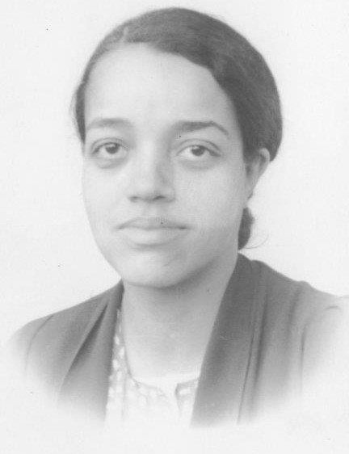
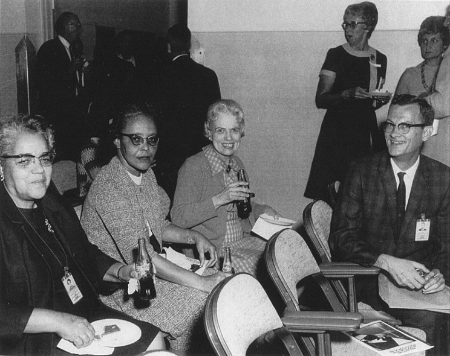

Já assistiu o excelente filme **Estrelas Além do Tempo** que conta a contribuição de 3 matemáticas nos primórdios da NASA? Se sim, provavelmente você já deve ter notado Dorothy Vaughan. Caso contrário, este post pode te ajudar a conhecer a história de uma das mulheres que contribuíram na execução do [Scout Launch Vehicle Program](https://www.nasa.gov/centers/langley/news/factsheets/Scout.html), projeto que foi crucial para os Estados Unidos vencerem a corrida espacial durante a guerra fria.

{:.center}

 
Dorothy  Vaughan nasceu em 1910 na cidade de Kansas City, no estado americano de  Missouri. Em  1929,  ela se graduou em matemática na Wilberforce University.  Após a  graduação, Dorothy  atuou como professora por quase 10  anos.

Seu primeiro contato com a NASA , que até então se chamava NACA, começou em 1943 quando ela com um grupo formado **exclusivamente por mulheres** que trabalhavam como computadores humanos. Depois de um tempo, Dorothy ganhou destaque com seu trabalho e se tornou a primeira mulher a exercer um cargo de liderança na NASA ao gerenciar os computadores humanos.

Este grupo, que também foi conhecido como  **The West Group Computers** realizavam **operações computacionais** e  **análise de dados** para os engenheiros aeronáuticos. Durante o período de liderança de Dorothy, [Mary W. Jackson](https://www.nasa.gov/content/mary-w-jackson-biography) e [Katherine Johnson](https://www.nasa.gov/content/katherine-johnson-biography), que também teve suas histórias contadas no filme, foram participantes do grupo de computadores humanos.

{:.center}

Em 1958, Dorothy e outras participantes do The West Group passaram a participar da divisão dedicada à análise e computação da NASA (ACD), um grupo que possuía um certo equilíbrio na questão de gênero. Durante sua participação, Dorothy também teve forte presença no Scout Launch Vehicle Program que teve o objetivo de lançar um satélite a uma órbita de 800 km da Terra. Com o sucesso deste projeto a NASA conseguiu equilibrar a corrida espacial, pois a Rússia já havia conseguido lançar seu satélite a uma órbita semelhante. 
 
Além de  matemática, Dorothy Vaughan também se tornou programadora e tinha a linguagem Fortran a principal ferramenta de uso.  A necessidade de usar a linguagem de programação Fortran  começou quando a NASA passou a utilizar computadores eletrônicos em seus projetos. Com a chegada desta poderosa ferramenta, era claro  que as ações que eram realizadas por  computadores humanos iriam passar a ser executadas  pelas máquinas computacionais eletrônicas.

{:.center}

No filme Estrelas além do tempo, há uma cena na qual Dorothy reúne um grupo de mulheres que não trabalhavam exclusivamente como matemática para ensinar programação usando Fortran. Os computadores que passaram a ser ferramentas de Dorothy e de suas companheiras eram Máquinas da IBM e que tinham dimensão de uma sala.

As histórias de Dorothy com The West Group Computers e de diversas outras mulheres que brilharam, brilham e que brilharão é a prova concreta da importância da presença feminina na engenharia e que nenhuma estrela além do tempo deve ficar escondida.

 

---------------------
<!-- autor -->

<h3 class="post-title">Autor</h3> 

  

    <table class="table-borderless highlight">
      <thead>
        <tr>
          <th></th>
        </tr>
      </thead>
      <tbody>
        <tr class="font-weight-bolder" style="text-align: center margin-top: 0">
          <td>Matheus Anselmo</td>
        </tr>
        <tr style="text-align: center" >
          <td style="color: #808080; vertical-align: top; text-align: justify"><small> Engenheiro de robótica  realizando pesquisa  no Centro de Competências em Robótica e Sistemas Autônomos do Senai Cimatec. Matheus é formado em engenharia de controle e automação pela UFBA e autor da frase "um cafezinho sempre cai bem antes e depois de outro cafezinho"
          .</small></td>
          <td></td>
        </tr>
      </tbody>
    </table>
  

 